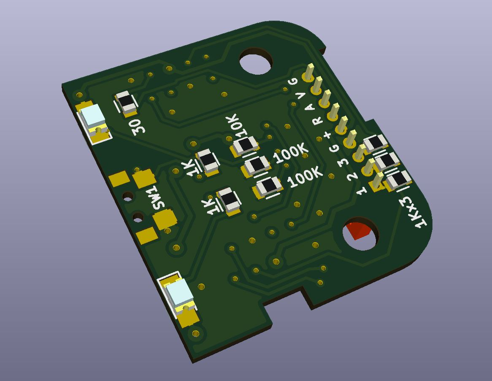
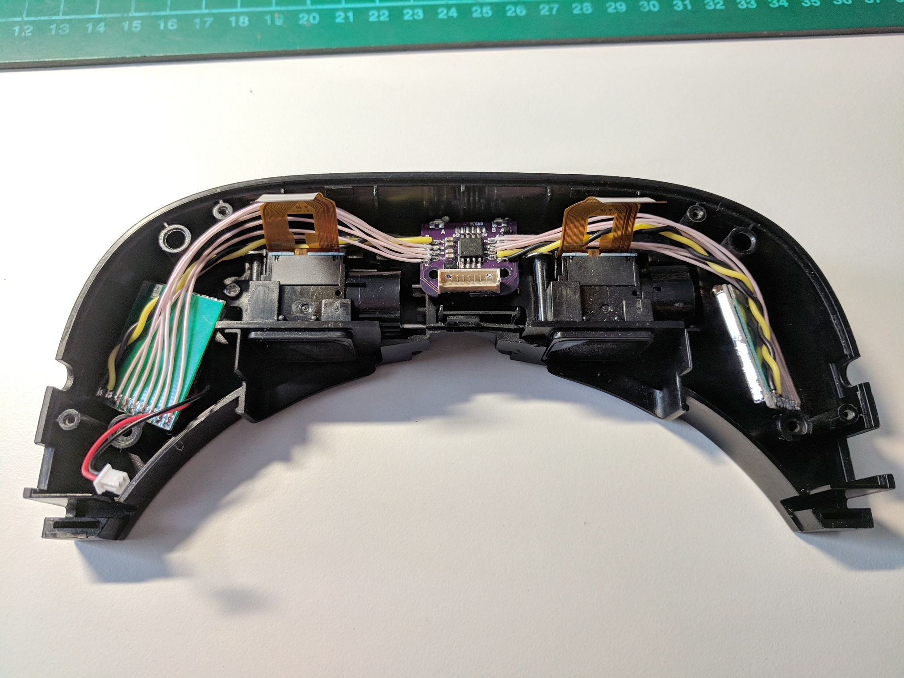
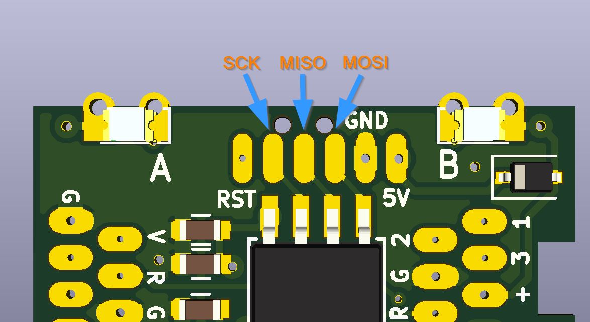

# Tiny 5.8GHz Diversity VRX for EV100 Goggles
Sample video, showing diversity in work (for example at 1:42).

Recording taken with [Eachine Pro DVR integrated in to the EV100 goggles](https://github.com/nppc/VideoSwitchDVR).

3D rendering of the board:

PCB can be ordered here: https://oshpark.com/shared_projects/An2v0djk

## Proof of concept
- Diversity bench test: https://www.youtube.com/watch?v=jwpYg-zWEIs
- Band/channel change and auto-search test: https://www.youtube.com/watch?v=jH8NeLfK5f4

## Calibration
- Power OFF VTX.
- Power ON Goggles and then press button on tVRX.
- LEDs will make 5 short (100ms) blinks indicating, that lowest video signal detection in progress.
- When LEDs will stay lit, then power ON VTX.
- After about 2 seconds LEDs will make 5 long (900ms) blinks indicating that highest video signal detection in progress.
- When LEDs turn OFF for 2 seconds, then Calibration is done.
- Now tVRX will exit from Calibration mode and go to normal state.

## Compiling
Use latest Arduino IDE.
You need to add ATtiny Support to Arduino IDE (Google the Internet). :)
In Arduino IDE Clock should be left as default = 1MHz (internal).
In this project we don't use Arduino bootloader. So, you need to export compiled binary from IDE and flash it with external programmer like USBasp.
Programming pads on tVRX:

All fuses leave default.

Discussion on RCG: https://www.rcgroups.com/forums/showthread.php?3051872-DIY-Tiny-Diversity-VRX-for-EV100-Goggles
